# NEU Course Wiki Frontend

Group Name: DarkHorse  
Group Members: Sixin Li, Zixin Zhao, Jiayan Ma

## Heroku Deploy  
https://coursewiki-frontend-darkhorse.herokuapp.com/

## Introduction

This is the NEU course Wiki Frontend.  

## Iteration 1 features

We've built the overall structure and implemented the React components related to the backend database.  
It contains three routes with their corresponding pages:
- Home Page:   
   

- Course Page: 
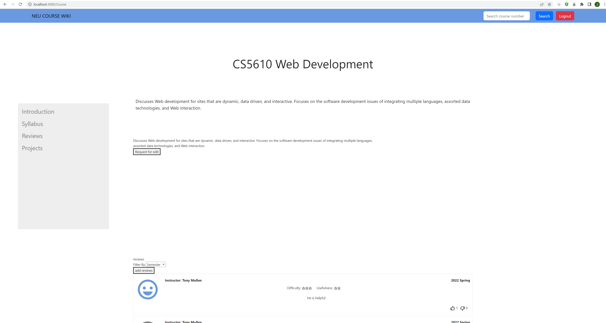  

- Project Page:  
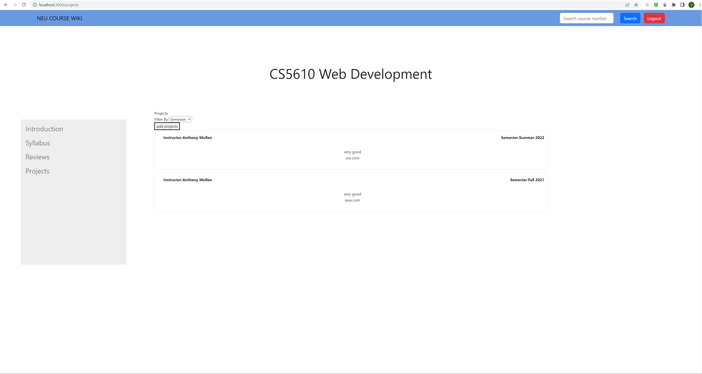  

## Contribution

#### Sixin Li 

- ​      Designed cards for displaying reviews in the course page  
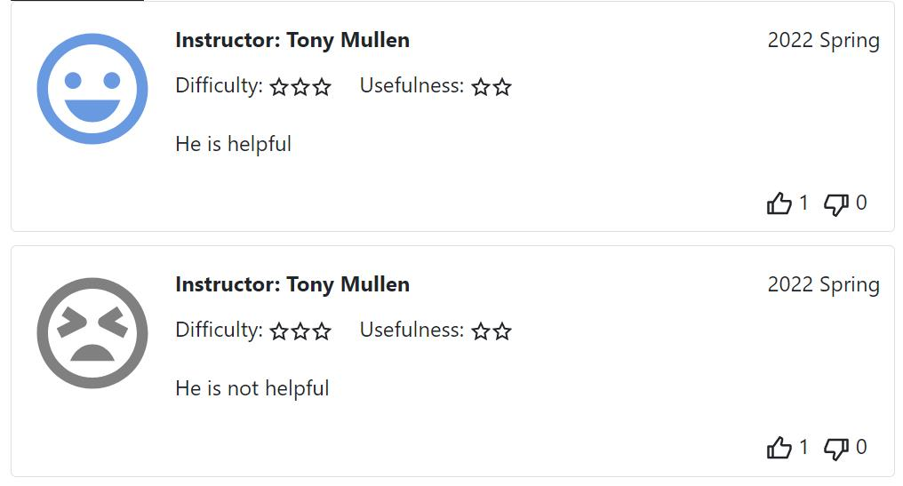  
       
- ​      Used third-party library "antd" to create the modal to add review  
 

#### Jiayan Ma

- ​      Built the overall React structure
- ​      Designed the home page and navigation bar
- ​      Created the pop up window for update syllabus on course page
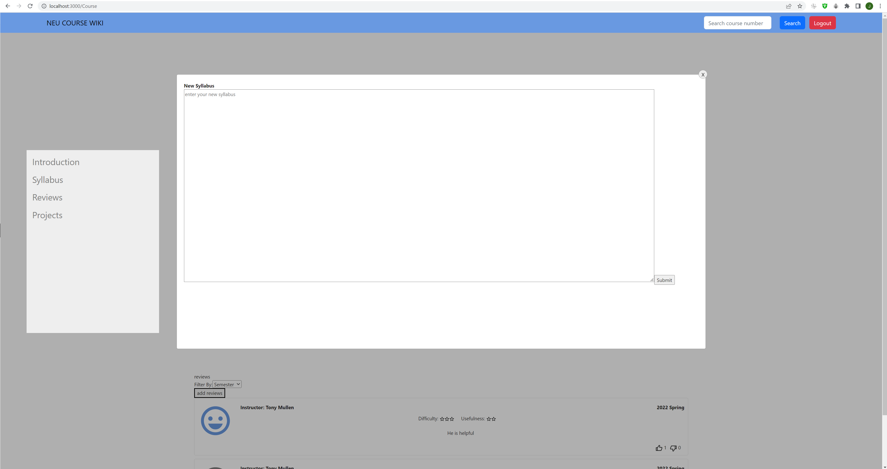  

#### Zixin Zhao

- ​      Designed projects page for displaying projects in the page
- ​      Used third-party library "antd" to create the modal to add projects  
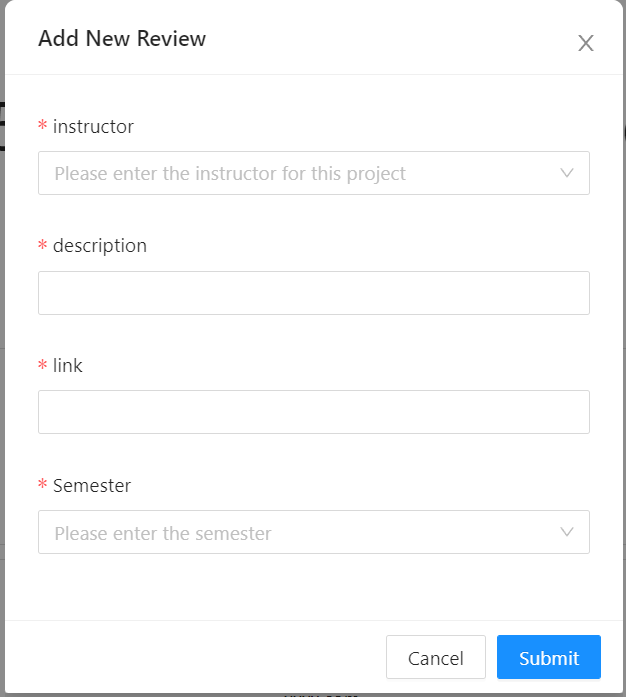  

## Iteration 2  

We implemented the data retrieval service, diplayed the backend data on pages and improved the user interaction.  
- Home Page:   
   

- Course Page: 
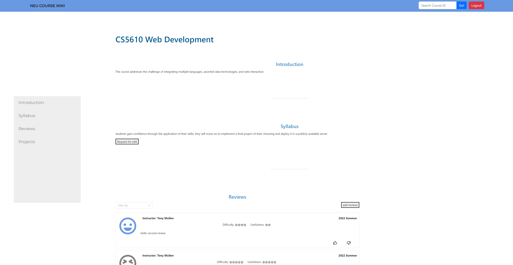  

- Project Page:  
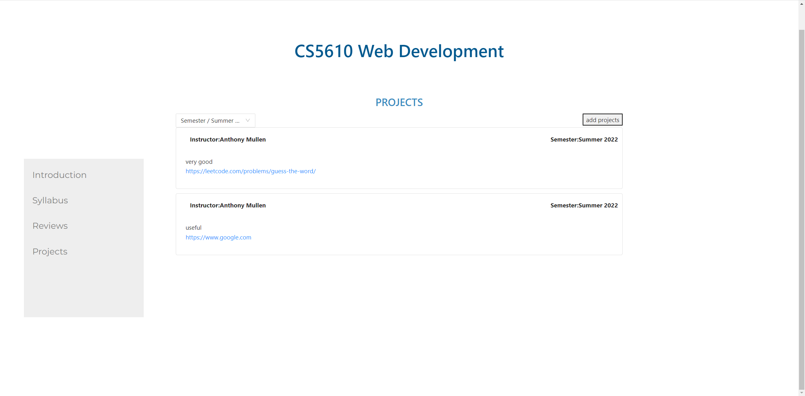  

## Contribution
#### Sixin Li  
- ​      Add cascader filters for semester and instructor in displaying reviews, and get reviews by filters from database  
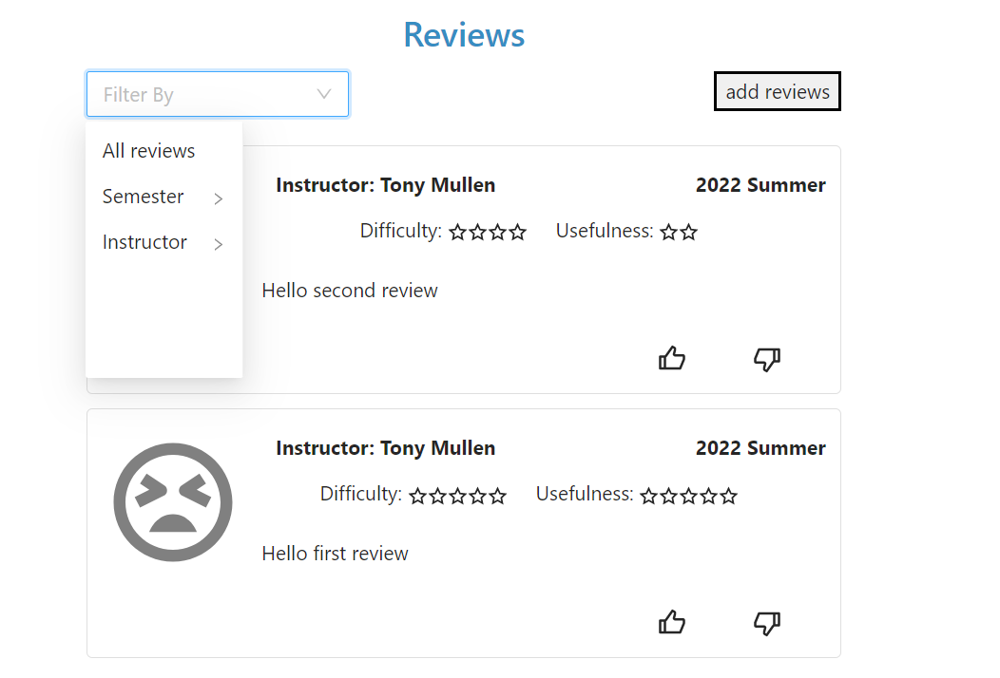  

- ​      Can get reviews from database and add reviews to database
- ​      Make thumbs up and down icons 
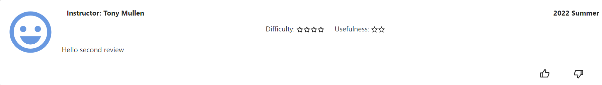  

#### Jiayan Ma  
- ​      Make the search boxes work on home page and navigation bar by getting course data by course_id from course database
- ​      Render home page and course page with better style design
- ​      Improve mobile friendly design  
  

- ​      Update pop-up window style of requesting edit syllabus to be consistent  
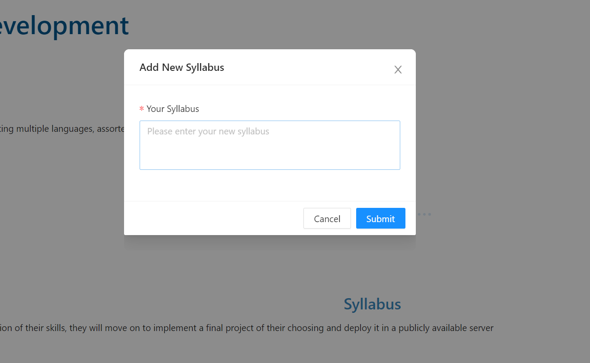  

- ​      Update search box on top navigation bar with a new bootstrap UI component - “inputgroup”  
  

#### Zixin Zhao  
- ​      Add cascader filters for semester and instructors in displaying projects, and get projects, by filters from database  
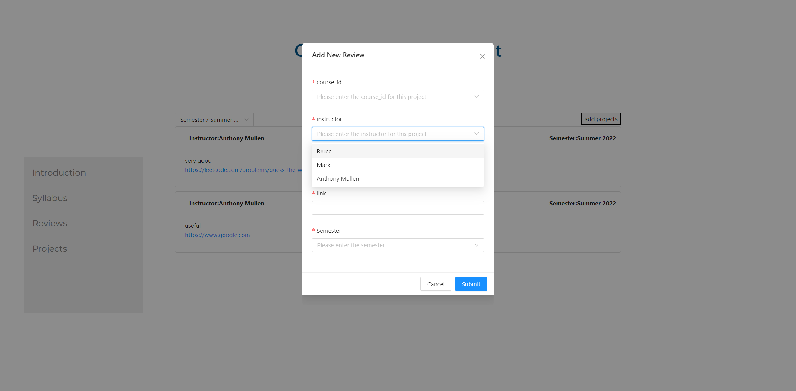  
- ​      Can get projects, from database and add projects, to database
- ​      Can get instructors by course_id from database

